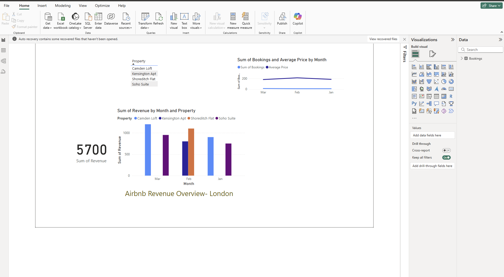

# Airbnb Revenue Power BI Dashboard – London

This beginner Power BI project analyzes Airbnb revenue trends across London, UK.  
It showcases data cleaning, visualizations, and dashboard creation using Power BI.

## 📊 Dashboard Features
- Total Revenue by London City
- Monthly Revenue Trends
- Clean and professional visuals using cards, bar charts & slicers

## 📁 Tools Used
- Power BI
- Excel (for data cleaning)
- Public Airbnb Dataset (mocked)

## 🧠 What I Learned
- Importing and transforming data in Power BI
- Creating dynamic visualizations
- Designing an interactive dashboard from scratch

## 📸 Screenshot

## 🚀 Future Plans
This project kicks off my data analyst portfolio. I'll be adding more dashboards and analysis projects over the next few weeks.

---

⭐ **Check out the dashboard PDF or screenshot in the files above.**
# airbnb-revenue-powerbi-dashboard
